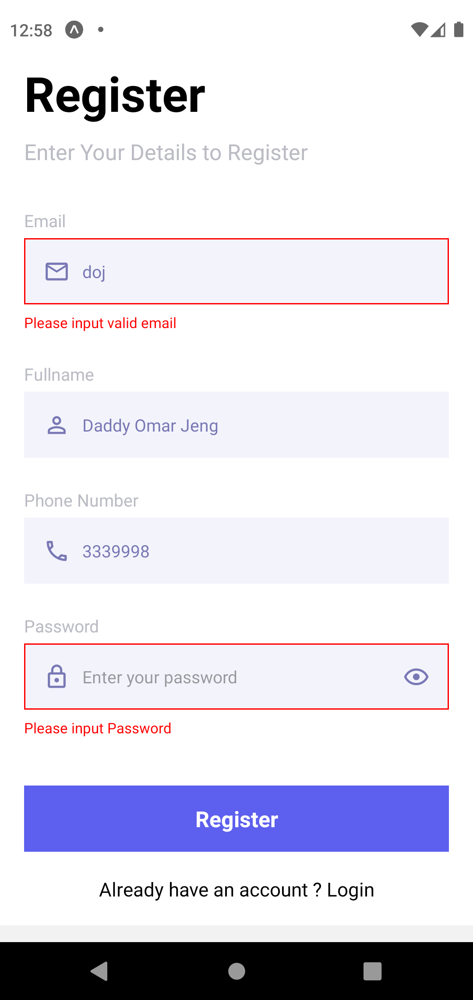
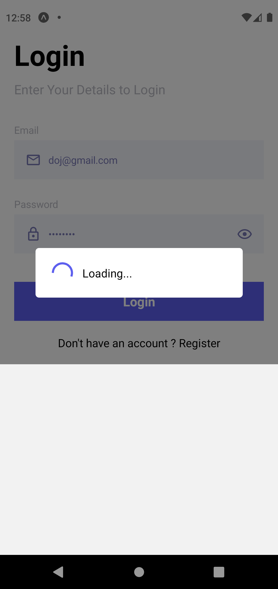

# react-native-login-registration

A React Native App with Registration, Login, loading Indicator, and Form Validation.
It is built with the **react-native-ui-doj**. A UI library i made to help me work faster.

- Here is the link:
  https://www.npmjs.com/package/react-native-ui-doj

## Screenshots

- ### Registration Screen   

         

- ### Login Screen   
         
- ### Home Screen    
  
